# 🧪 Chaos Engineering & Resilience Lab

[](https://azure.microsoft.com)
[](https://www.terraform.io)
[](https://www.docker.com)
[](https://opensource.org/licenses/MIT)
[](https://github.com/OliwierOzgaIT/azure-serverless-monitoring/actions)

An advanced Azure-based laboratory designed to validate cloud resilience through automated fault injection. This project leverages **Infrastructure as Code (IaC)** to deploy a controlled environment where CPU saturation, network latency, and storage exhaustion are systematically simulated to test observability, alerting, and system stability.

---

## 🎯 Objective

This project establishes a **Resilience Testing Framework** on Microsoft Azure. The goal is to move from *hoping* a system works to *knowing* it can survive failures. By automating the injection of faults into a distributed environment, the lab validates monitoring pipelines, alerting thresholds, and real-world system behavior under extreme stress — before those failures happen in production.

---

## ✨ Key Features

- **Multi-Layer Fault Injection:** Experiments spanning CPU saturation, network latency, and storage exhaustion provide a holistic picture of system resilience.
- **Containerized Chaos:** Pumba operates as a chaos agent within the Docker runtime, injecting network conditions at the container level without touching the host.
- **Automated Provisioning:** The full environment — VNET, NSG, VM, and Docker runtime — is stood up in minutes using a single Terraform command chain.
- **Security-First Design:** Port 22 SSH access is locked to a specific admin IP via NSG rules, enforcing least-privilege even during high-load experiments.
- **Reproducible Infrastructure:** Every resource is defined in version-controlled Terraform HCL, enabling rapid regional pivoting when capacity constraints arise.

---

## 🛠️ Tech Stack

| Layer | Technology |
|---|---|
| Infrastructure as Code | Terraform (HCL) |
| Cloud Provider | Microsoft Azure |
| Container Runtime | Docker |
| Chaos Tools | `stress-ng` (CPU), Pumba (Network), `fallocate` (Storage) |
| Observability | Linux native telemetry (`top`, `df`, `syslog`), Azure Monitor |
| Governance | Azure Network Security Groups (NSG) |

---

## 🏗️ Architecture

Pumba acts as a chaos agent within the Docker runtime, injecting network latency into the Nginx container to simulate real-world service degradation. Azure Monitor tracks CPU, network, and storage metrics in parallel, capturing the system's behavior and recovery profile throughout each experiment.

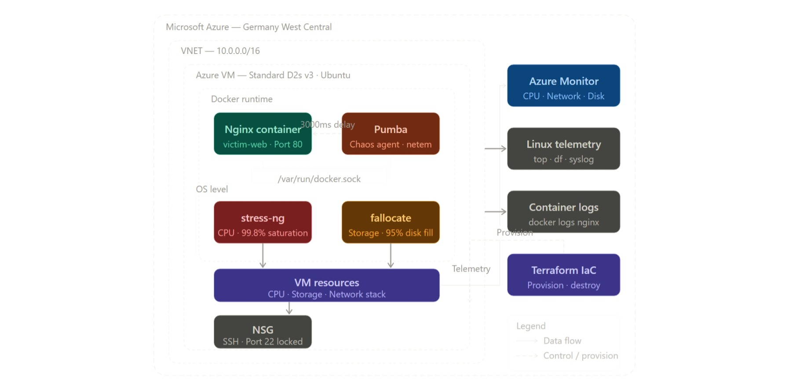

---

## 📂 Repository Structure

The project follows a modular directory structure to ensure scalability and maintainability:

```
.
├── code/
│   ├── terraform/              # Core IaC files (HCL) for Azure provisioning
│   └── scripts/                # Shell automation scripts for setup and fault injection
├── screenshots/                # Architecture diagrams, experiment evidence, and portal views
├── .gitignore                  # Excludes .tfstate, provider plugins, and secret variables
└── README.md
```


---

## 🚀 Deployment

### Prerequisites

- **Azure CLI** — Authenticated via `az login`
- **Terraform** — Version 1.0.0 or higher
- **SSH Key** — For secure access to the Virtual Machine

### Infrastructure Setup

Deploy the entire environment using a single command chain:

```bash
# Initialize Terraform and download providers
terraform init

# Review and deploy the plan
terraform apply -auto-approve
```

> [!IMPORTANT]
> After a successful `apply`, Terraform will output the Public IP of the VM. Save it — you'll need it for SSH access in the next steps.

> [!IMPORTANT]
> **Post-Installation Step:** After `deploy.sh` finishes, log out and log back in (or run `newgrp docker`) for Docker group changes to take effect. This allows chaos commands to run without `sudo`.

### Teardown

To maintain fiscal responsibility and avoid cloud sprawl, destroy all resources when finished:

```bash
terraform destroy -auto-approve
```

---

## 🔬 Infrastructure Lifecycle

### 1. Environment Readiness

Before deploying, the environment is prepared through secure authentication and tool verification:

- **Azure CLI Authentication** — Establishing a secure session via `az login`.
- **Workspace Navigation** — Setting the execution context to the `code/terraform` directory.
- **Version Validation** — Confirming compatibility between local Terraform binaries and the Azure API.

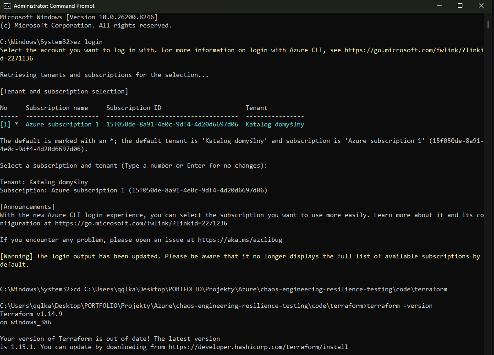

### 2. Initialization & Planning

- **Backend Initialization** — Running `terraform init` to download and install the `hashicorp/azurerm v3.117.1` provider, creating a `.terraform.lock.hcl` file to pin provider versions for reproducible deployments.
- **Execution Planning** — Generating a preview with `terraform plan` to validate the full VM configuration: Ubuntu 22.04 LTS (Jammy), `Standard_B1ms`, SSH key injection, and governance tagging before any resources are created.
- **Governance Tagging** — Resources tagged with `Environment: Dev`, `Project: ChaosEngineering`, `Tool: Terraform`.

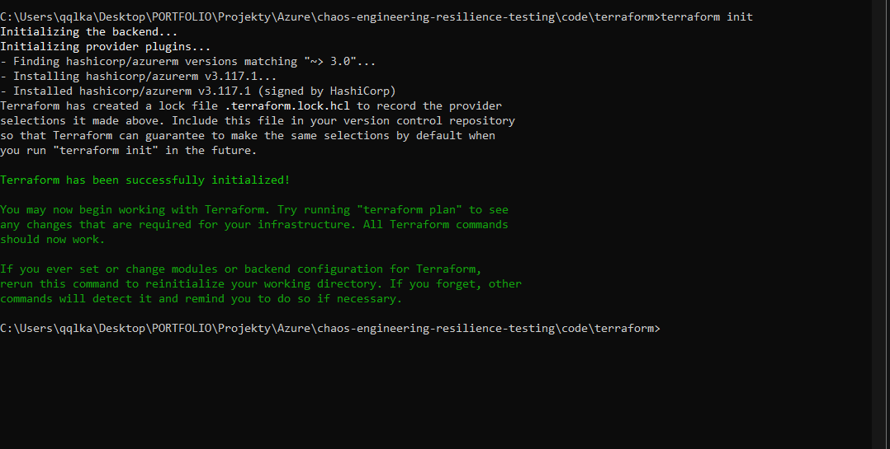
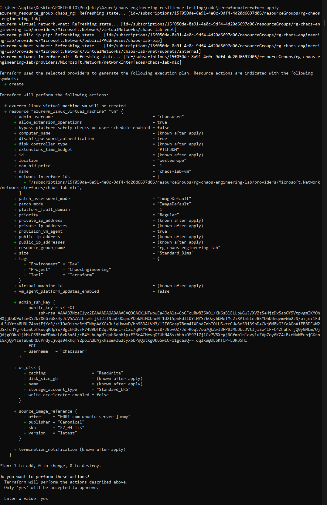
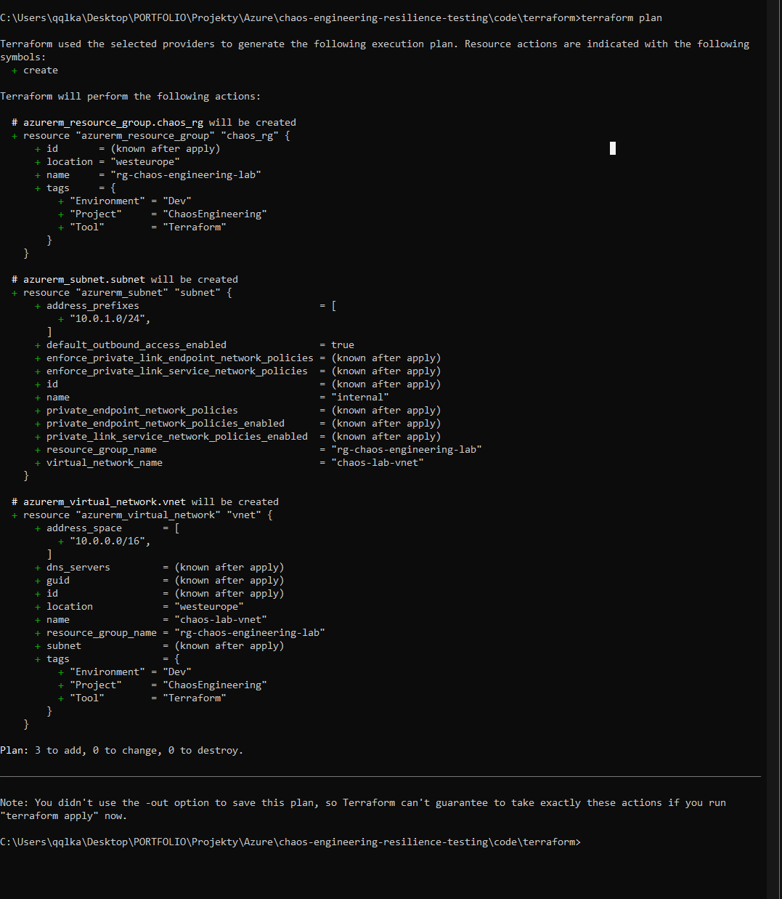

### 3. Provisioning & Verification

- **Manual Approval Gate** — Workflow requires an explicit `yes` confirmation before resource creation.
- **Resource Sequence** — Orchestrated creation of Resource Groups, VNETs, Subnets, NSG, and the VM.
- **Portal Verification** — Visual confirmation of deployed assets and tagging compliance in the Azure Portal.

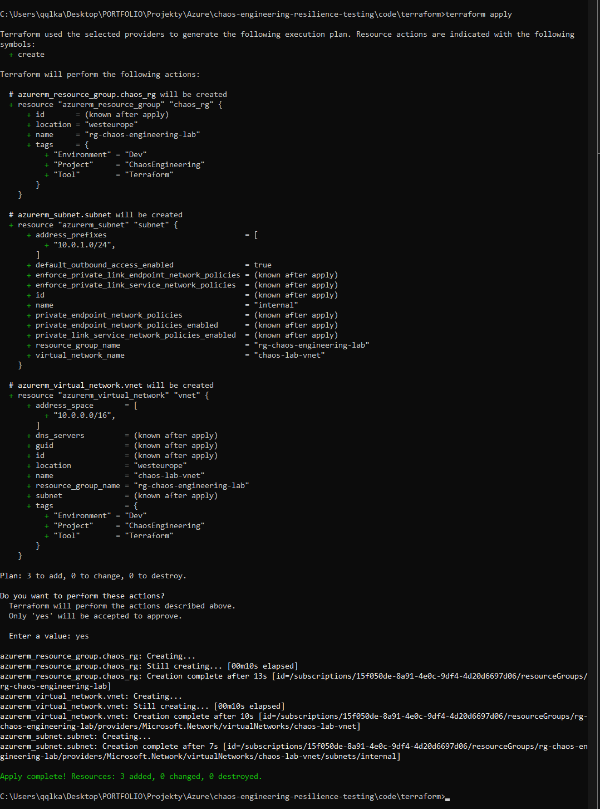
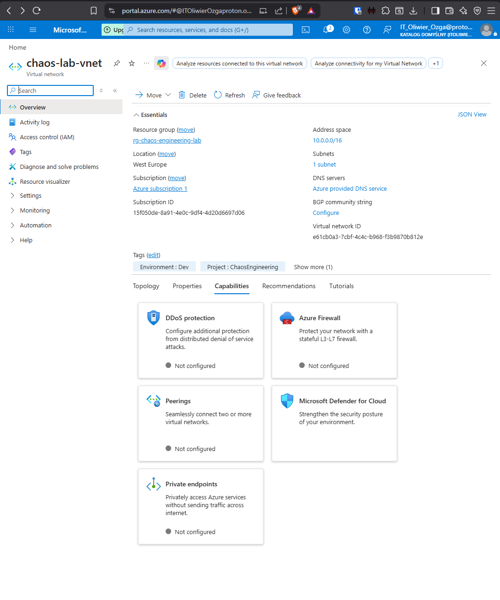
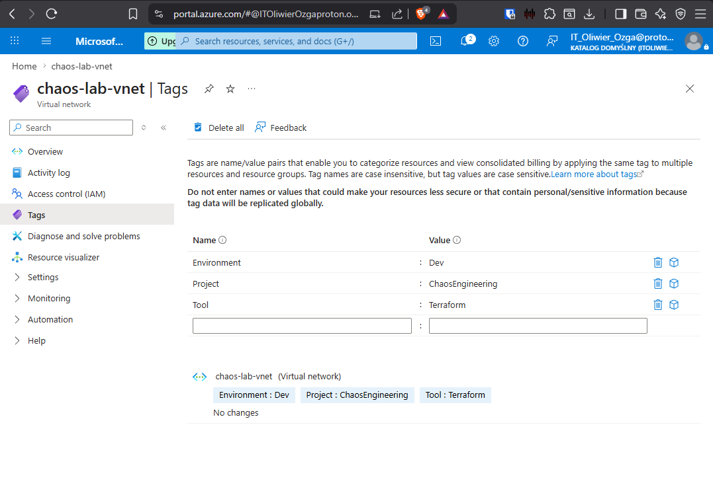

### 4. NSG Security Implementation

- **Least-Privilege Access** — NSG rule `AllowSSH` configured in Terraform with `priority: 1001`, restricting inbound Port 22 traffic exclusively to the admin IP `213.77.4.233`. All other sources are implicitly denied.
- **NIC Association** — The NSG is attached directly to the VM's network interface via `azurerm_network_interface_security_group_association`, ensuring rules are enforced at the instance level.
- **Applied & Verified** — `terraform apply` confirmed 2 resources added and 1 changed, with the NSG creation completing in 3 seconds.

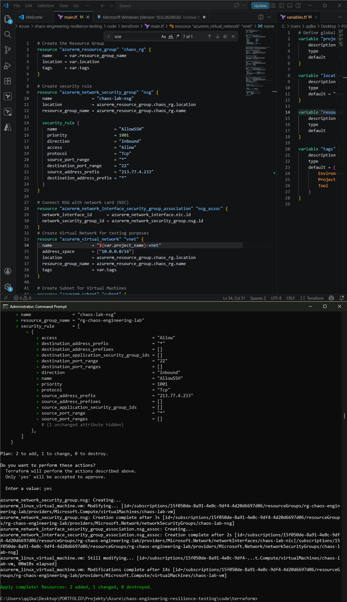

### 5. SSH Access & Runtime Verification

- **Secure Connection** — SSH session established to `chaosuser@4.210.65.88` (public IP) using a key pair. The ED25519 host fingerprint was verified and permanently added to known hosts.
- **System Baseline** — Ubuntu 22.04.5 LTS confirmed running on Azure kernel `6.8.0-1052-azure`. System load at `0.08`, memory usage at `3%`, and disk at `5.6% of 28.89GB` — a clean baseline before any fault injection.
- **Docker Validation** — Docker Engine v29.1.3 confirmed installed and operational. The `docker run hello-world` test verified the daemon, image pulling from Docker Hub, and container execution are all working correctly on the VM.

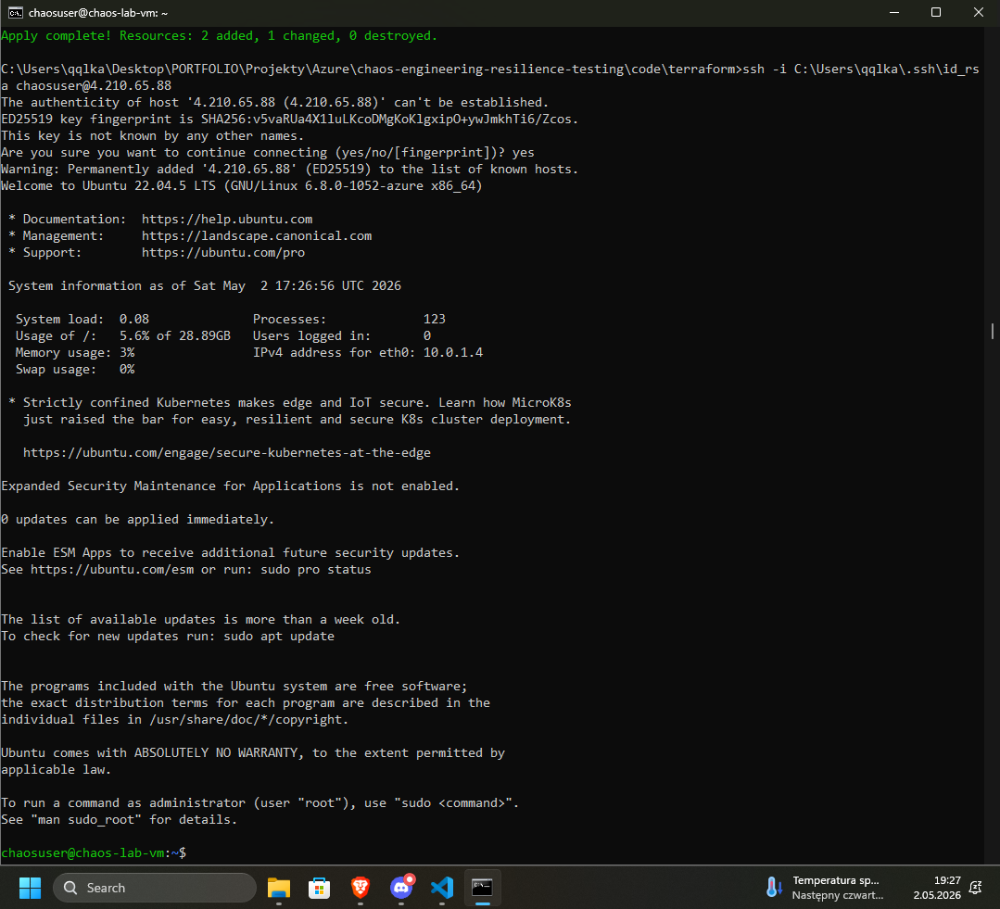
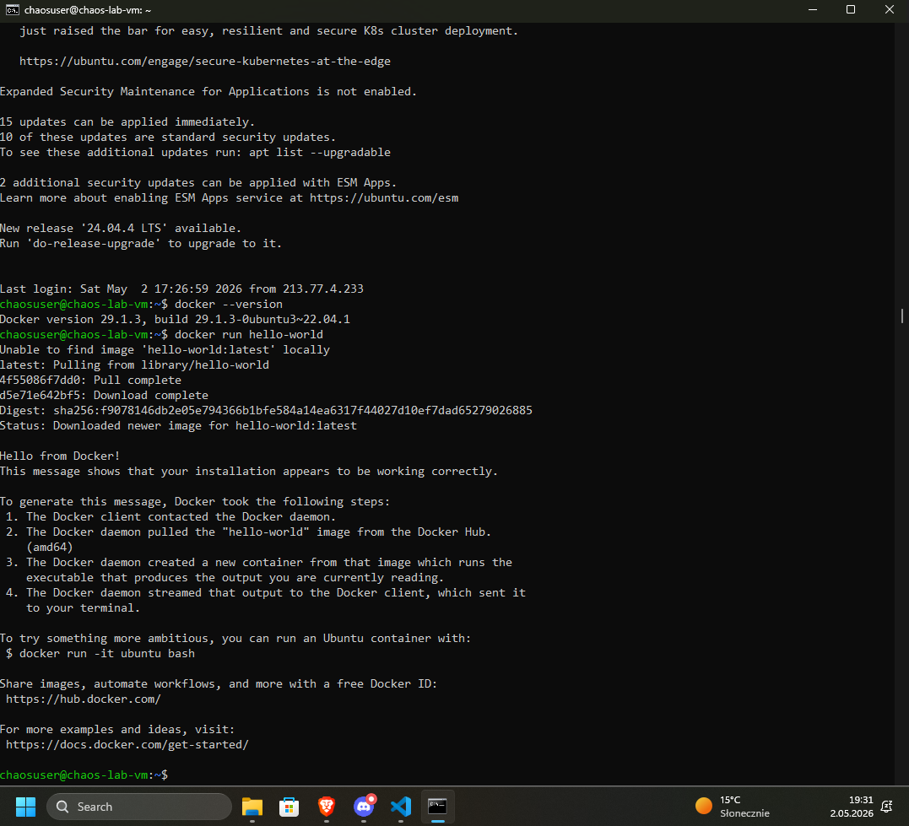

---

## 🔨 Chaos Experiments

### Phase 1 — CPU Saturation

- **Tool:** `stress-ng`
- **Command:** `stress-ng --cpu 0 --timeout 60s`
- **Observation:** Telemetry via `top` confirmed **99.8% CPU utilization** across all cores while the kernel remained stable throughout the test window.

```bash
stress-ng --cpu 0 --timeout 60s
```

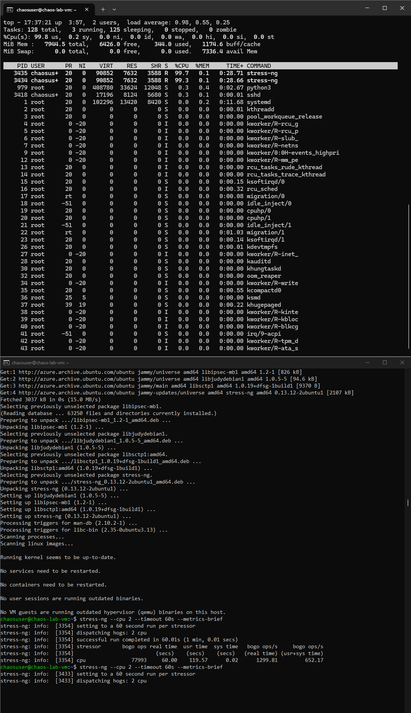

---

### Phase 2 — Network Latency

- **Tool:** `Pumba`
- **Command:** Injecting a **3000ms delay** into the `victim-web` Nginx container for 60 seconds.
- **Observation:** Application-level degradation verified with `curl`, simulating the real-world impact of a slow upstream service.

```bash
docker run --rm -v /var/run/docker.sock:/var/run/docker.sock gaiaadm/pumba \
    netem --duration 60s --delay 3000ms victim-web
```

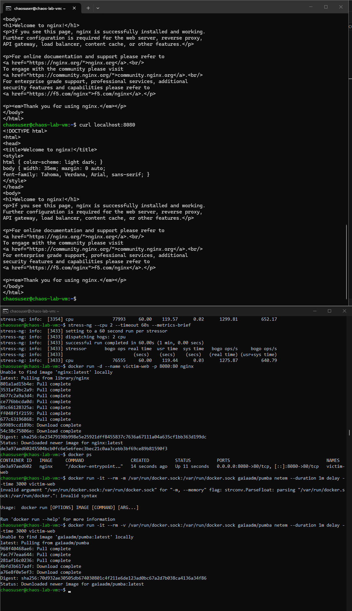

---

### Phase 3 — Storage Exhaustion

- **Tool:** `fallocate`
- **Command:** Instantly allocating a **25GB file** (`chaos_disk_hog.img`) on the root partition.
- **Observation:** `df -h` confirmed disk occupancy reaching **95%**, successfully validating storage monitoring thresholds.

```bash
fallocate -l 25G chaos_disk_hog.img && sleep 60 && rm chaos_disk_hog.img
```

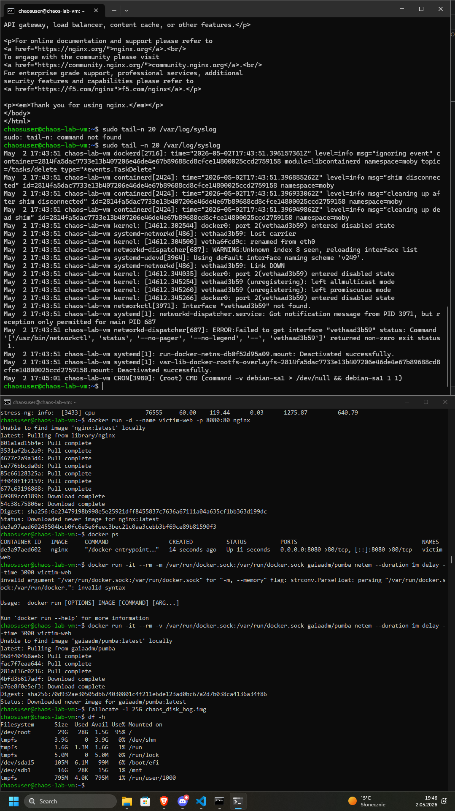

---

## 🧩 Challenges & Solutions

| Challenge | Description | Resolution |
|:---|:---|:---|
| **SkuNotAvailable** | 409 Conflict encountered for the `Standard_B1ms` VM size in `westeurope`. | Pivoted to `Standard_B1s` in `germanywestcentral` — a single variable change in Terraform triggered a full regional redeploy. |
| **Regional Capacity Constraint** | Insufficient capacity in `westeurope` blocked the initial deployment entirely. | Migrated to `germanywestcentral`; Terraform forced a NIC replacement due to the region change, completing cleanly with 2 added, 1 changed. |
| **Unauthorized SSH Exposure** | Default SSH configuration risked unauthorized access during public-facing chaos tests. | Implemented the `AllowSSH` NSG rule in `main.tf` locking Port 22 to a single admin IP (`213.77.4.233`), applied via `terraform apply` in under 15 seconds. |

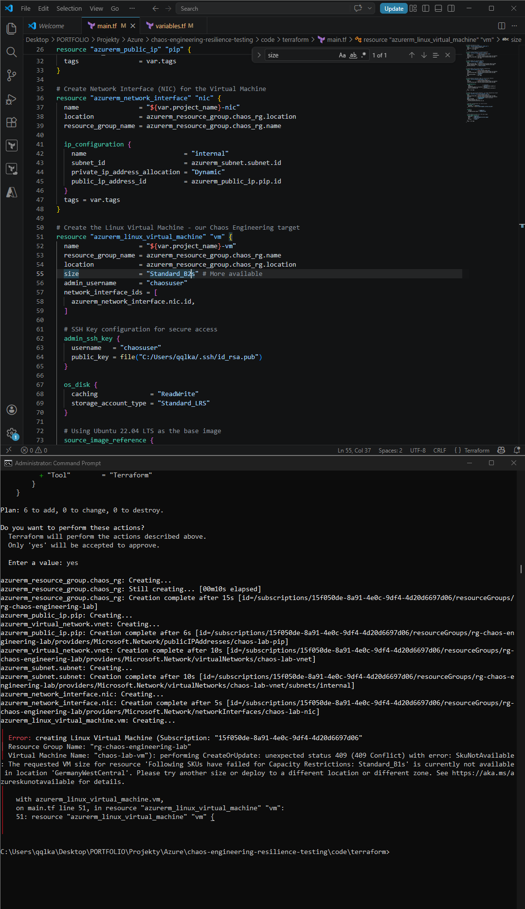
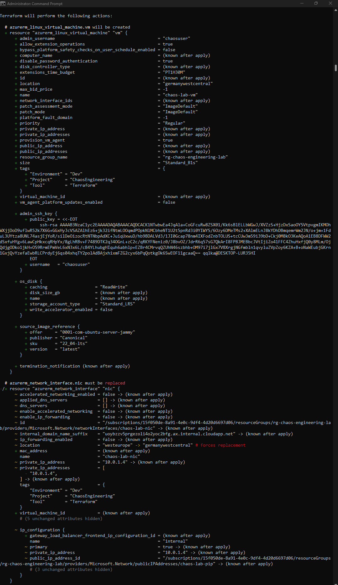

---

## 🏁 Conclusion

This lab successfully demonstrated the synergy between **Infrastructure as Code** and **Chaos Engineering**. By automating the full infrastructure lifecycle, the project enabled rapid regional pivoting during capacity failures and systematically validated that the environment could survive extreme compute, network, and storage stress — turning uncertainty into measurable confidence.

### 💡 Key Takeaways

- **IaC is Essential** — Terraform enabled immediate regional recovery when SKU availability failed, with zero manual rework.
- **Observability Matters** — Native Linux tools like `syslog` and `top` confirmed fault injection was working as intended at every layer.
- **Security-First** — Least-privilege NSG rules ensured the environment remained locked down even during maximum-load experiments.

---

## 👤 Author

**Oliwier Ozga** — [LinkedIn](https://www.linkedin.com/in/oliwier-ozga-380192405/)

---

## 🤝 Credits & Acknowledgments

- Inspired by the Chaos Engineering guide from **mzazon** — [mzazon/cloud-projects](https://github.com/mzazon/cloud-projects/tree/main/azure/chaos-engineering-resilience-testing).
- Special thanks to the open-source community for providing tools like **Pumba** and **stress-ng**.
- Guided by real-world **SRE (Site Reliability Engineering)** principles of fault tolerance and proactive resilience testing.
